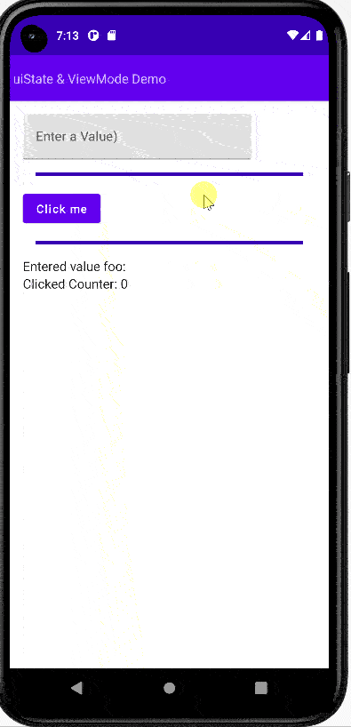
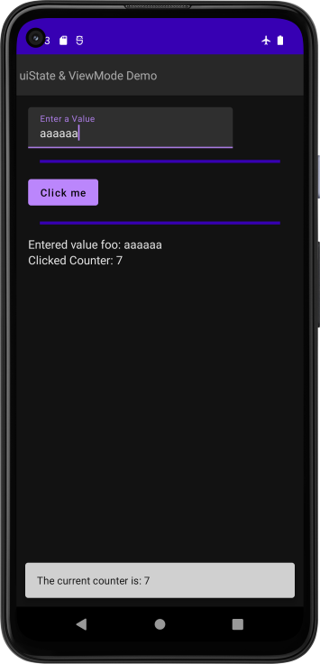

# Demo UiState ViewModel App
Simple app to demonstrate uiState and viewModel and Snackbar one time events 

- TextField for foo_name
- One Button for counter
- no dependency injection

### Display Snackbar
- Added Scaffold
- Snackbar one time event set in view model
- LaunchedEffect in screen

  
    

ref: demo-uistate-viewmodel-app-android-kotlin-compose